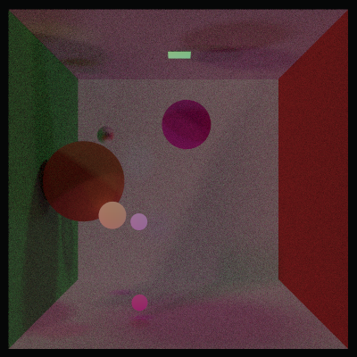
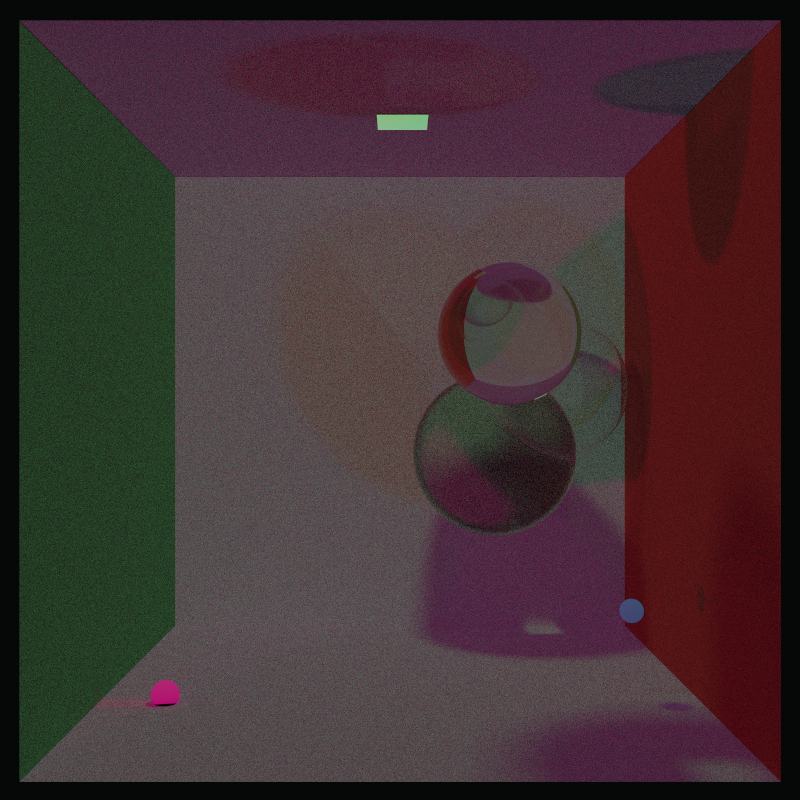
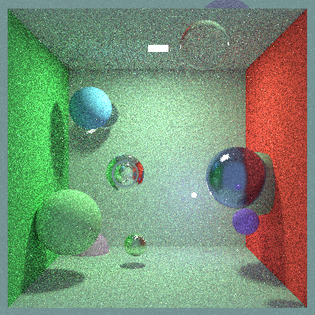
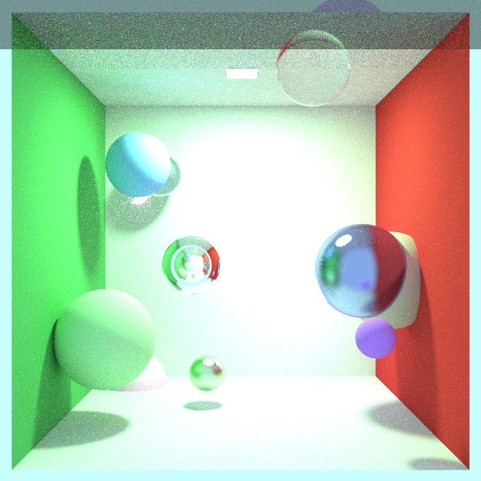

# Path tracer

For UI and drawing the render I use [ImGui](https://github.com/ocornut/imgui) with GLFW and OpenGL3 backend and
additional libraries for saving the image: [STB image](https://github.com/nothings/stb)
and [tinyfiledialogs](https://github.com/native-toolkit/libtinyfiledialogs)

## Implementation

Implemented following the [Ray Tracing in One weekend](https://raytracing.github.io/) guide by Peter Shirley.

Features:

- Monte Carlo sampling
- Lambertian/Glass/Metal Material
- Sphere/Rectangle Diffuse Light
- Russian roulette optimizer
- Oren-Nayar for roughness and angle of incidence
- Focused rendering
- [De-noising](https://github.com/wrathchild14/PTNetworks) - uses a U Net implementation of a de-nosing network trained on data generated from this path tracer
	- for now it only its only trained on one shape (1, 3, 400, 400)	

Some results:




### Improvements:

- Adding new meshes
- Faster rendering (parallelization) - current version doesn't work nicely
- Positioning of the camera
- Selecting which sphere to focus

## How did the path tracer improve

### 91 samples, 30 sample depth

Russian roulette



Final render with nearly 500 samples per pixel in a 800:800 picture



## Development

### Windows

Opening the solution file should work

### Linux

Install OpenGL (Debian-based)
```
sudo apt install libglfw3-dev
```

Building and running (cmake)
```bash
cmake .
make

./Pathtracer
```

## Random data


Lines of code (23.5.2023) :
```
   91 ./Application.cpp
   34 ./Application.h
   339 ./Main.cpp
   25 ./Materials/DiffuseLight.h
   58 ./Materials/Glass.h
   36 ./Materials/Lambertian.h
   36 ./Materials/Material.h
   25 ./Materials/Metal.h
   11 ./Materials/Pdf.h
   119 ./Materials/Pdfs.h
   107 ./ModelController.cpp
   26 ./ModelController.h
   341 ./PathTracer.cpp
   61 ./PathTracer.h
   23 ./Primitives/FlipFace.h
   36 ./Primitives/Hittable.h
   113 ./Primitives/HittableList.cpp
   39 ./Primitives/HittableList.h
   52 ./Primitives/Rectangle.cpp
   108 ./Primitives/Rectangle.h
   76 ./Primitives/Sphere.cpp
   36 ./Primitives/Sphere.h
   38 ./Utility/AABB.h
   66 ./Utility/Camera.h
   32 ./Utility/Common.h
   39 ./Utility/OrthonomalBasis.h
   22 ./Utility/Ray.h
   185 ./Utility/Vec3.h
   2174 total
```
